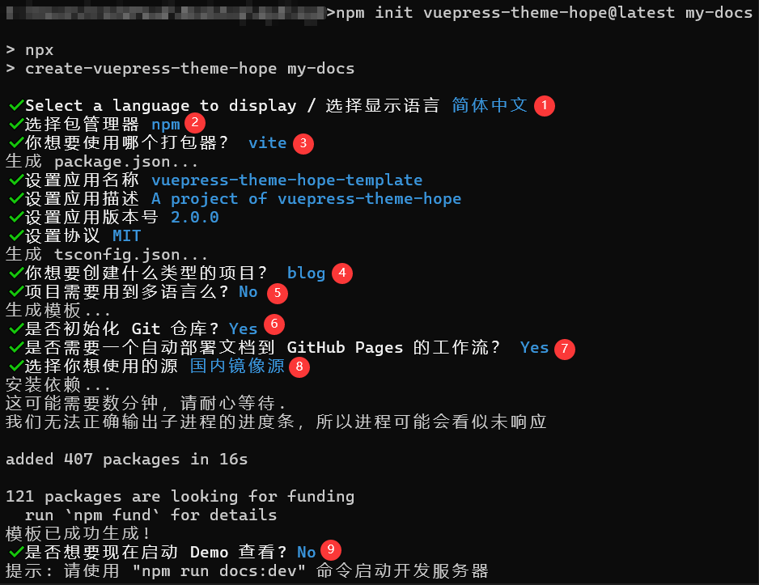
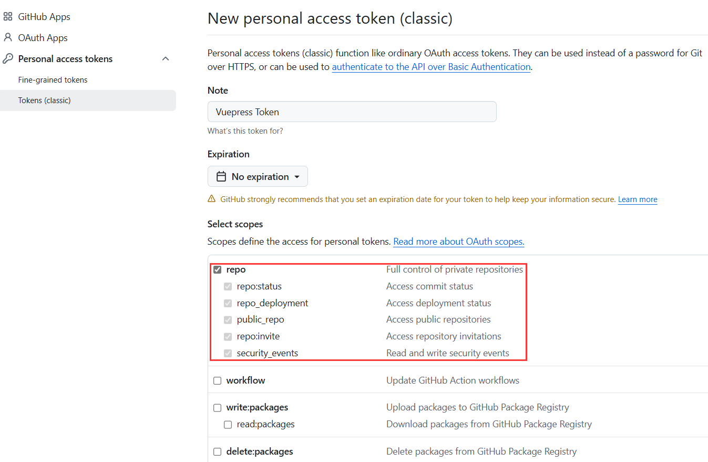
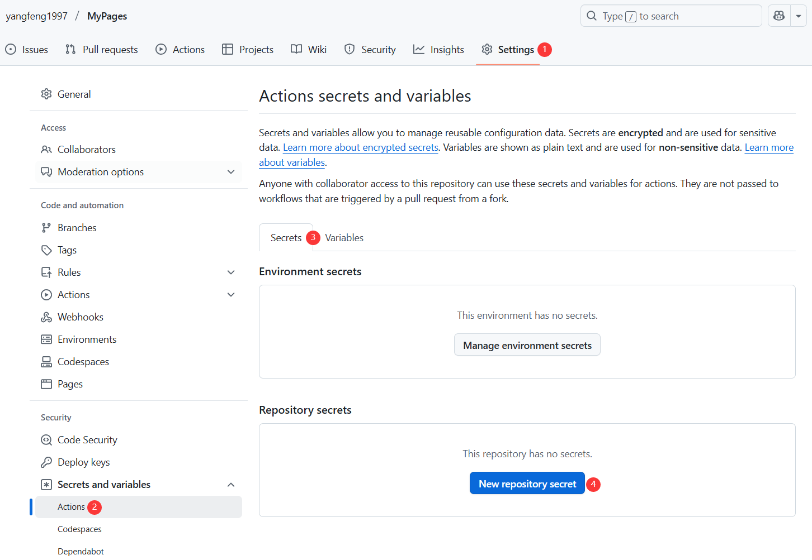
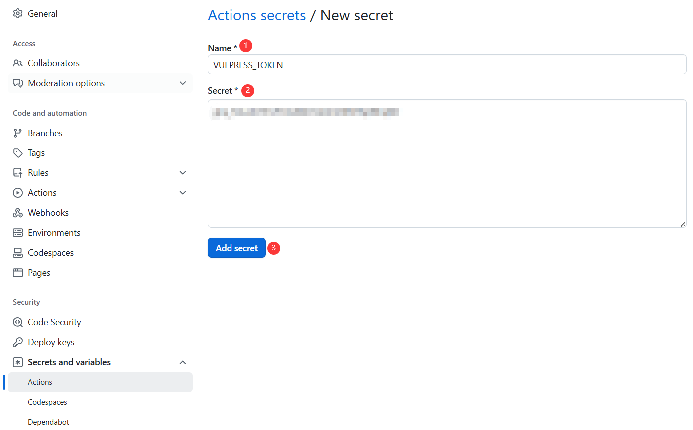
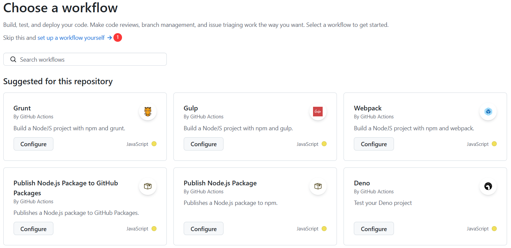
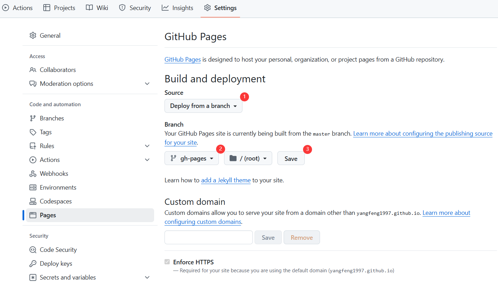
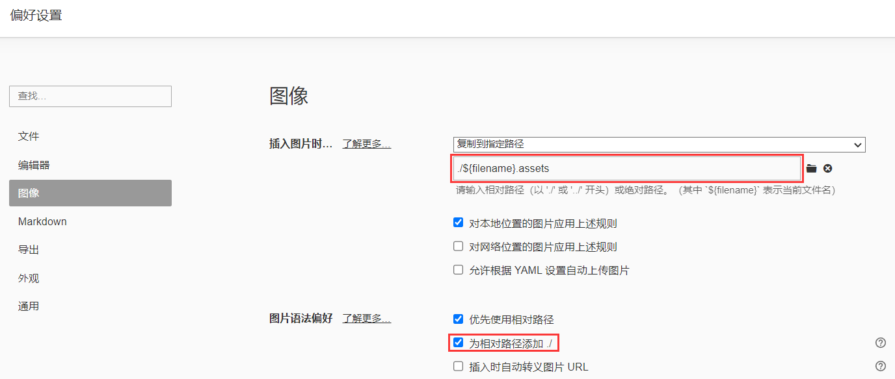

VuePress 是一个基于 Vue.js 的静态网站生成器，最初由 Vue.js 核心团队成员 Evan You (尤雨溪) 创建，主要用于编写技术文档，但现已发展为一个功能强大的静态站点生成工具。适合构建个人网站、博客或文档站点。下面详细记录构建过程！

## 创建项目

**第一步：安装 Node.js。**

MacOS 使用 HomeBrew 安装。 

```shell
# 安装node
brew install node
node -v
npm -v
# 升级npm
npm install -g npm@11.3.0
```

Windows上，需要去官网上下载 node，点击 [下载地址](https://nodejs.org/zh-cn/) 左侧的绿色按钮 (LTS)。

**第二步：创建VuePress项目。**

注意：为了避免一些因为路径引起的字符编码问题，需要使用纯英文路径，如：`D:\my-docs`。

在终端执行如下命令：

```shell
npm init vuepress-theme-hope@latest my-docs
```

在初次创建项目过程中，可以选择语言，通过键盘↑和↓方向键，以及回车键选择。



**注意**：为了后面部署到 github actions 上面，最好选择初始化仓库，并且部署 GitHub Pages 工作流。

在模板初始化成功后出现了一些 URL，你就可以在浏览器地址栏输入 `http://localhost:8080/` 访问开发服务器了。

项目创建的目录结构如下：

```
.
├── .github                         (可选的) GitHub 配置文件存放路径
│    └── workflow → GitHub          工作流配置
│         └── docs-deploy.yml       自动部署文档的工作流
│
├── src →                           文档文件夹
│    │
│    ├── .vuepress                  (可选的) VuePress 配置文件夹
│    │    │
│    │    ├── dist                  (默认的) 构建输出目录
│    │    │
│    │    ├── public                (可选的) 静态资源目录
│    │    │
│    │    ├── styles                (可选的) 用于存放样式相关的文件
│    │    │
│    │    ├── config.{js,ts}        (可选的) 配置文件的入口文件
│    │    │
│    │    └── client.{js,ts}        (可选的) 客户端文件
│    │
│    ├── ...                        其他项目文档
│    │
│    └── README.md                  项目主页
│
└── package.json                    Nodejs 的配置文件
```

注：使用此种方式会自动安装主题：vuepress-theme-hope。[官方文档](https://theme-hope.vuejs.press/zh/)

## 项目命令

`vuepress dev <dir>` 会启动一个开发服务器，以便在本地开发你的 VuePress 站点。

`vuepress build <dir>` 会将你的 VuePress 站点构建成静态文件，以便进行后续部署。

因为上面已经安装了 VuePress Theme Hope 模板，就可以在 package.json 中发现下列三个命令：

```json
{
  "scripts": {
    "docs:build": "vuepress build src",                                // npm run docs:build 构建项目并输出
    "docs:clean-dev": "vuepress dev src --clean-cache --clean-temp",   // npm run docs:clean-dev 清除缓存并启动服务器
    "docs:dev": "vuepress dev src"                                     // npm run docs:dev 启动服务器
  }
}
```

升级主题和 VuePress 版本，可以执行命令：

```
npx vp-update
```

## 配置文件

VuePress 使用文档文件夹 `src `中的 `.vuepress` 文件夹存放配置。在 VuePress 中，有三种配置概念：

- **站点配置**：站点配置中的配置项被 VuePress 直接读取，和主题无关且在所有主题均可生效。每一个站点都应该有它的 `lang`, `title` 和 `description` 等属性，因此 VuePress 内置支持了这些属性的配置。[参考文档](https://vuejs.press/zh/reference/config.html)
- **主题配置**：主题配置是你传递给 `hopeTheme` 函数的对象，它将由 VuePress Theme Hope 处理。[参考文档](https://theme-hope.vuejs.press/zh/config/theme/basic.html)
- **页面配置**：由在页面顶部基于 YAML 语法的 Frontmatter 提供。[参考文档](https://vuejs.press/zh/reference/frontmatter.html)

具体选项参考的[配置介绍](https://theme-hope.vuejs.press/zh/config/intro.html)，其中 `.vuepress/config.ts` (或 `.vuepress/config.js`) 是必要的配置文件（必须存在）。

模板中为了避免配置文件过长，会使用 JavaScript 原生提供的 ESM 特性：将主题配置、导航栏和侧边栏配置拆分到了单独的文件夹中。模板将主题函数抽离到了 `.vuepress/theme.ts` 中，并通过 `export default` 导出。

文件如下：

```
config.ts       # 项目配置
navbar.ts       # 导航栏
sidebar.ts      # 侧边栏
theme.ts        # 主题配置
```

将主题函数抽离到了 `.vuepress/theme.ts`，并通过 `export default` 导出。

```js
// theme.ts

import { defineUserConfig } from "vuepress";

export default defineUserConfig({
    // 此处放置配置
});
```

在配置文件中直接引入抽离的 theme.ts：

```js
// config.ts

// 在这里引入主题
import theme from "./theme.js";

// ...

export default defineUserConfig({
    // ...
    
    // 这和 theme: hopeTheme({/* 主题配置 */}) 是等价的
    theme,
    
    // ...
});
```

## 修改主题样式

VuePress Theme Hope 主题使用 `.vuepress/styles` 文件夹存放样式配置（[参考文档](https://theme-hope.vuejs.press/zh/config/style.html)）。可以在此文件夹中：

- 创建 `index.scss` 来注入额外的 CSS 样式。
- 创建 `config.scss` 来进行样式配置。
- 创建 `palette.scss` 来配置颜色与布局。

## 文档创建

VuePress 是以 Markdown 为中心的。项目中的每一个 Markdown 文件都是一个单独的页面。默认情况下，页面的路由路径是根据 Markdown 文件的相对路径决定的。如果上面是通过创建助手生成的，默认会得到以下文件结构：

```
└─ src
   ├─ demo
   │  ├─ ...
   │  └─ page.md
   │  └─ markdown.md
   │  └─ README.md
   ├─ ...
   └─ README.md
```

Markdown 文件对应的路由路径为：

| 相对路径        | 路由路径        |
| --------------- | --------------- |
| /README.md      | /               |
| /demo/README.md | /demo/          |
| /demo/page.md   | /demo/page.html |

`README.md` 是特例，在 Markdown 中，按照约定俗成，它会作为所在文件夹的主页。所以在渲染为网页时，它的对应路径为网页中的主页路径 `index.html`。

## github pages部署

需要先说明的是，在创建过程中选择了创建自动部署文档的 GitHub 工作流，那么需要做的就是设置正确的 **base 选项**。如果你想让你的网站部署到一个子路径下，你将需要设置它。需要以斜杠开始并以斜杠结束。举例来说，如果你想将你的网站部署到 `https://xxx.github.io/bar/`，那么配置文件中的 `base` 应该被设置成 `"/bar/"`。

1. 如果你准备发布到 `https://<USERNAME>.github.io/`，你必须将整个项目上传至 `https://github.com/<USERNAME>/<USERNAME>.github.io` 仓库。在这种情况下你无需进行任何更改，因为 base 默认就是 `"/"`。
2. 如果你的仓库地址是一个普通的形如 `https://github.com/<USERNAME>/<REPO>` 的格式，网站将会被发布到 `https://<USERNAME>.github.io/<REPO>/` ，也就是说，你需要将 base 设置为 `"/<REPO>/"`。

下面说明部署过程：

**第一步：获取 Personal Access Token**

进入个人github，依次点击：头像 -> Settings -> Developer settings -> Personal Access Token -> Tokens (classic)。

点击：Generate new token -> New personal access token (classic) -> 填写和勾选选项-> Generate token。



**第二步：将代码推送到 Github**

使用 git 命令即可，比如本地文件夹是 my-docs，需要将 my-docs/ 下的文件全部推送到自己的仓库中。

在 my-docs 文件夹下执行如下命令：

```
# 初始化仓库，在创建项目的时候已经执行过
git init
# 添加远程仓库地址
git remote add origin https://github.com/yangfeng1997/MyPages
# 若远程仓库已存在文件，需先拉取合并
git pull origin master --allow-unrelated-histories
# 增加修改的文件
git add .
git commit -m "new post"
git push -u origin master
```

**第三部：使用 Github Action 部署**

1. 添加 Repository secret，点击仓库的：Settings -> Secrets and variables -> Actions -> Secrets -> New repository secret。

   

   

2. 点击 Action，选择新建一个自己的 workflow 配置文件（如果创建项目时选择初始化 Github pages 工作流，这一步可以忽略）。

   

   如果在创建项目的时候选择初始化 Github pages 工作流，会自动生成 `.github\workflows\deploy-docs.yml` 文件，内容如下：

   ```
   name: 部署文档
   
   on:
     push:
       branches:
         - master   # ⚠️注意：这里是你的仓库的分支，看清楚是 main 还是 master
   
   permissions:
     contents: write
   
   jobs:
     deploy-gh-pages:
       runs-on: ubuntu-latest
       steps:
         - name: Checkout
           uses: actions/checkout@v4
           with:
             fetch-depth: 0
             # 如果你文档需要 Git 子模块，取消注释下一行
             # submodules: true
   
         - name: 设置 Node.js
           uses: actions/setup-node@v4
           with:
             node-version: 22
             cache: npm
   
         - name: 安装依赖
           run: |
             corepack enable
             npm ci
   
         - name: 构建文档
           env:
             NODE_OPTIONS: --max_old_space_size=8192
           run: |-
             npm run docs:build
             > src/.vuepress/dist/.nojekyll
   
         - name: 部署文档
           uses: JamesIves/github-pages-deploy-action@v4
           with:
             # 部署文档
             branch: gh-pages
             folder: src/.vuepress/dist
   ```

3. 等待 Action 执行完成，来到 Settings -> Pages -> Build and deployment 设置页面，选择 `gh-pages` 作为 GitHub Pages 的源。

   

   接着你就可以在浏览器访问地址即可。比如：https://yangfeng1997.github.io/MyPages。

## 增加评论Giscus

使用 giscus 增加评论，需要先满足如下三个步骤：

1. 使用 github 的公开仓库的评论区作为文档评论的存放点（私有仓库需要 GitHub Pro）。
2. 需要先安装 giscus，安装只需访问 [giscus](https://github.com/apps/giscus)，点击右边蓝色按钮 install，选择自己的 github 账户，点击 Only select repositories，选择自己刚才建的仓库，点击 install 即可。
3. 仓库的 Discussions 功能已启用。点击 Setting，找到 Features，勾选上 Discussions。 

访问 [Giscus 官网](https://giscus.app/zh-CN) 进行配置：

1. 填写刚才创建的 GitHub 仓库（格式：username/repo）

2. 选择 Discussions 分类（建议新建一个专门用于评论的分类）

3. 配置其他选项：

   - 评论框位置（顶部/底部）
   - 默认主题（light/dark/跟随系统）

   - 语言
   - 其他高级选项

4. 配置完成后，Giscus 会生成一段 JavaScript 代码，类似这样：

   ```
   <script src="https://giscus.app/client.js"
           data-repo="yangfeng1997/MyGiscus"
           data-repo-id="R_kgDOOfso7Q"
           data-category="Announcements"
           data-category-id="DIC_kwDOOfso7c4Cpdyp"
           data-mapping="pathname"
           data-strict="0"
           data-reactions-enabled="1"
           data-emit-metadata="0"
           data-input-position="bottom"
           data-theme="preferred_color_scheme"
           data-lang="zh-CN"
           data-loading="lazy"
           crossorigin="anonymous"
           async>
   </script>
   ```

   最后将对应的字段配置加到自己的主题配置中即可！

## Typora插入图片

在使用 Markdwon 写作的时候，用的最多的工具大概是 Typora，一个最棘手的问题就是 Markdown 中的图片插入问题，因为 Markdown 中的图片仅为一个 URL，一般需要使用图床。

有的静态博客必须要将插入的图片放在 `public/images` 固定的路径下，这就造成在写作过程中，如果需要频繁的插入图片，将会非常繁琐，导致效率也大大降低。如果能将 Typora 写作时图片的自动插入路径和静态博客可读取的路径互相兼容，那么在 Typora 中看到的效果，就是静态博客中看到的效果。VuePress 中已经考虑到了这种情况，只需要对 Typora 的图片选项进行一定的设置，就可以完美兼容！

**方法1：使用 `public` 目录（不推荐）**

将图片放入 `.vuepress/public` 目录（如 `.vuepress/public/assets/post/example.jpg`）。引用时直接使用绝对路径：

```

```

Typora 设置：偏好设置 → 图像 → 选择 [复制到指定路径]。

**方法2：webpack 自动处理（推荐）**

与 Markdown 文件同级的 `./${filename}.assets` 文件夹，引用时引用的相对路径，webpack 会自动处理：

```

```

Typora 设置：偏好设置 → 图像 → 选择 [复制到指定路径]。路径名和方法 1 的绝对路径不同，而是同级相对路径。然后最重要的一点是，需要勾选 [为相对路径添加./]，因为 Markdown 以相对路径插入图片的语法就是以 `./` 开头，不勾选自动插入不能正常显示图片。



注意：**文档文件名中不能有空格**！！！

## 增加RSS支持

需要在配置中开启，只有在部署后才会显示页面，在开发环境中好像调不出来，

```
plugins: {
  feed: {
    rss: true,
  },
}
```

默认情况下，`@vuepress/plugin-feed` **只在 `build`（生产构建）时生成 Feed 文件**，而不会在 `dev`（开发服务器）模式下生成。
如果你希望在本地开发时也能访问 `feed.rss`、`feed.atom` 或 `feed.json`，就必须显式设置 `devServer: true`。


## 文章 Frontmatter 模板

VuePress 中，`frontmatter` 是用于配置页面级元数据的核心概念，以 YAML 格式写在 Markdown 文件的顶部。允许你自定义页面的属性，比如标题、时间、标签、分类等。[参考文档](https://theme-hope.vuejs.press/zh/config/frontmatter/info.html)

一些常用的 frontmatter 属性如下：

```
title:  							// 标题
date: 								// 时间 (如 2025-04-24 01:40:44)
description: xxx                  	// 页面描述
icon: 								// 页面文章的图标 (如 ::b:apple::)
author:  	                        // 作者，不填是默认博主
category:							// 分类，支持数组
  - HTML
  - Web
tag:								// 标签，支持数组
  - HTML
  - Web
article:							// 是否将该文章显示到文章列表，默认true
timeline:							// 是否将该文章显示到时间线，默认true
sticky:								// 是否在列表中置顶，当填入数字时，数字越大排名越靠前
star:								// 是否标为星标文章，当填入数字时，数字越大排名越靠前
cover:								// 页面的预览图
banner:								// 页面的宽屏分享图
license:							// 页面协议名称，默认主题选项中的值
copyright:							// 页面的版权信息，会在页脚中显示
```

一个常规的**博客文章**可以使用非常简洁的 frontmatter 模板：

```
---
title: 
date: 
author: 
category:
  - XXX
tag:
  - XXX
---
```

一些笔记什么的，就可以用下面的 frontmatter 模板：

```
title: 
date: 
category:							// 分类，支持数组
  - HTML
tag:								// 标签，支持数组
  - HTML
article: false
timeline: false
```

